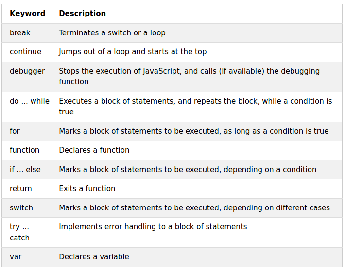
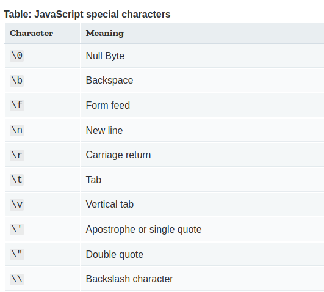
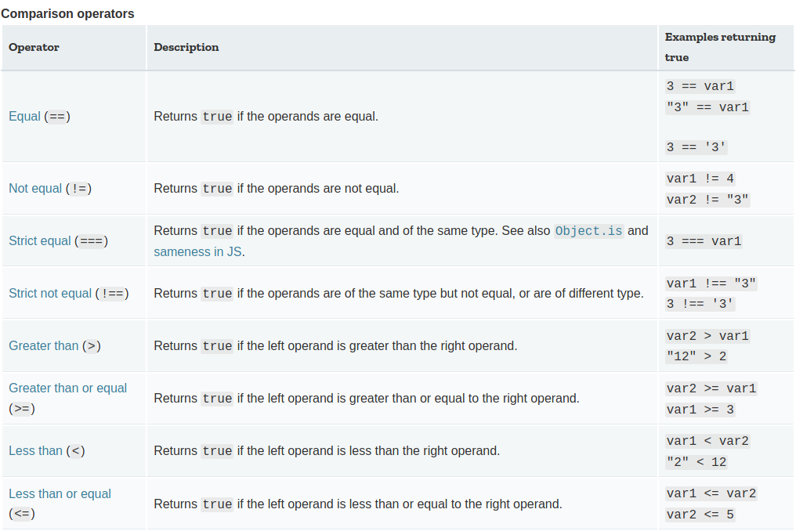
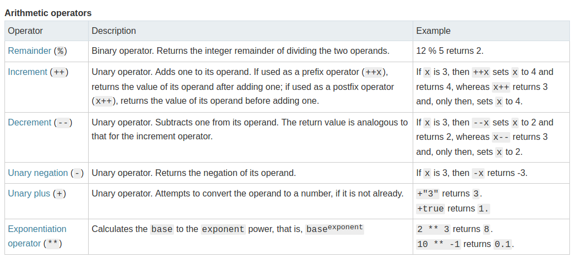

# Introducción a JS


## ¿Qué es Javascript?

**JavaScript (JS) es un lenguaje de programación multiplataforma**

- **Se considera un lenguaje orientado a objetos, pero en realidad es multiparadigma, soporta otros paradigmas como el imperativo y el funcional.**
- Es un lenguaje basado en prototipos
- **Es un lenguaje interpretado (o just-in-time compiled)**
- Java y Javascript no tienen relación como lenguajes de programación. Sin embargo al igual que Java, Javascript es una marca registrada de Oracle.
- Las implementación de JS se rigen por el estándar ECMA-262.
- El nombre oficial del lenguaje es ECMAScript.
- Fue inventado en 1995 por Brendan Eich
- JS originalmente se creo para "darle vida" a los navegadores, es decir, para hacerlo más interactivos.
- JS nació cómo un lenguaje del lado del cliente, es decir que solo se podía ejecutar en navegadores web. Actualmente se puede ejcutar JS en  aplicaciones de escritorio, dispositivos móviles y en aplicaciones de escritorio.

## ¿Por qué aprender JS?

- Una de la razones por las que debes aprender JS es que se pueden crear aplicaciones para casi todas las plataformas (web, móvil y de escritorio) y no solo aplicaciones sino que también servidores.

- Incluso, algunos motores de base de datos como MongoDB y CouchDB usan javacript como su lenguaje de programación por defecto.

- Existen librerías/paquetes desarrolladas por la comunidad para casi todo tipo de requerimientos y lo mejor de todo es que casi siempre encontraremos dichos paquetes en un solo lugar **npm**.

  

- ### Ventajas

* Simplicidad. La sintaxis de javascript es muy sencilla.
* Populariad. Javascript es un lenguaje muy popular lo cual le garantiza tener soluciones implementadas por la comunidad para casi todas las necesidades.
* Interoperable. Javascript puede ser usado en junto con otros lenguajes de programación como Pearl y PHP.
* Funcionalidad extendida. Js permite extender la funcionalidad de algunos sitios web al incorporar scripts de js a estos.
* Rápido. Js tiende a ser un lenguaje rápido siempre que no tenga que obtener recursos externos.

### Desventajas

* Vulnerabilidades del lado del cliente. Al ser un lenguaje del lado del cliente en ocasiones se suelen encontrar un bug que puede ser explotado para propósitos malicisos.

* Soporte de navegadores. En pleno 2020 esto ya no es una desventaja, actualmente todos los navegadores soportan JS en sus últimas versiones.

* Tricky language. A veces un puede tener dolores de cabeza al debugear un programa escrito en JS por que a veces hace varias asumpciones implicitas, por ejemplo, si se compara 3 y '3' dara como resultado que son verdaderos, es decir:

  ```js
  if (3 == '3'){
      console.log("Se cumplió la condición")
  }else{
      console.log("No se cumplió la condición")
  }
  ```

  El resultado del programa anterior es que se cumplió la condición.

## Evolución del lenguaje

En las primeras versión del lenguaje hasta la versión ES5, no se incorporaban clases ni exponenciación en la versión ES6.

Sin embargo las clases se implementaban a través de la palabra reservada `function`. 

ES6 tiene las siguientes características:

- JavaScript `let`
- JavaScript `const`
- JavaScript Arrow Functions
- JavaScript Classes
- Parámetros con valores por defecto
- `Array.find()`
- `Array.findIndex()`
- Exponentiation (`**`) (EcmaScript 2016)

## Motores de JS 

ECMAScript es desarrollado por Google, Mozilla y Microsoft principalmente y cada uno de ellos ha creado su propio motor de JS.

* Spider Monkey es el nombre del motor de JS de Mozilla, uno de los primer en crearse.
* V8 es el motor de JS de Google Chrome
* Jscript es desarrollado por Microsoft para soportar JS en su navegador (Edge browser) y también para su sistema operativo.

## Frameworks y librerías más famosas de JS

* NodeJS. Es un entorno de desarrollo cuya base es el V8, el motor de JS de Google.

  

* React JS

  

* Angular JS

  

* Vue JS

  

* jQuery

* React Native

  

* Express JS

  

* Electron JS. Algunas aplicaciones que desarrolladas en electron son Geogebra, Typora, Atom.

  

## Herramientas para ejecutar JS

* [JavaScript.com](https://www.javascript.com/try)
* [PlayCode](https://playcode.io/)
* [ES6 console.com](https://es6console.com/)
* [jsconsole.com](https://jsconsole.com/)
* [jsfiddle](https://jsfiddle.net/)
* [Plunker](https://plnkr.co/)
* [JSbin](https://jsbin.com/?html,output)
* [CodePen](https://codepen.io/)
* [Stackblitz](https://stackblitz.com/)

## Typescript

TypeScript es un lenguaje de programación de código abierto desarrollado y mantenido por Microsoft. Es un estricto superconjunto sintáctico de JavaScript y agrega una escritura estática opcional al lenguaje. TypeScript está diseñado para el desarrollo de grandes aplicaciones y transcompilaciones a JavaScript.


## ¿Dónde encontrar información?

* La mejor documentación que he tenido oportunidad de leer está en la página  de desarolladores de Mozilla.
  * [MDN web docs](https://developer.mozilla.org/en-US/docs/Web/JavaScript)
  * [JavaScript reference](https://developer.mozilla.org/en-US/docs/Web/JavaScript/Reference)
* [w3schools.com](https://www.w3schools.com/Js/)
* [javascript.info](https://javascript.info/)
* [What the f*ck is JavaScript?](https://github.com/denysdovhan/wtfjs)
* [jshero](https://www.jshero.net/en/success.html)

## Sintaxis básica

* JS es case-sensitive, sensible a mayúsculas y minúsculas
* Usa el conjunto de caracteres Unicode
* El punto y coma (;) son es necesario para separar sentencias (instrucciones).

Un programa de computadora es una lista de "instrucciones" para ser "ejecutadas" por una computadora.

En un lenguaje de programación, estas instrucciones de programación se denominan declaraciones.

Un programa de JavaScript es una lista de declaraciones de programación.

```js
var x, y, z;    // Statement 1
x = 5;          // Statement 2
y = 6;          // Statement 3
z = x + y;      // Statement 4
```

**Algunas palabras reservadas del lenguaje son**



### Comentarios

Los comentarios existen en todos los lenguajes de programación y nos sencillamente son sentencias o comentarios (valga la redundancia) que no serán tomados en cuenta por el intérprete.

Para poner comentarios en JS tenemos las siguientes opciones.

* Comentario de una línea, se utiliza `//`
* Comentario de multiples líneas: Tiene un inicio y un fin
  * El inicio se denota con `/*` y el fin com `*/`

```js
// Comentario de una línea
/*
	Comentario
	de varias 
	líneas
*/
// Lo siguiente fallará
/*
	Nose pueden anidar comentarios
	/*
	anidado
	*/
*/
```

## Variables y tipos de datos

Una variable es donde se guarda (y se recupera) datos que se utilizan en un programa.


Para declarar una variable en JS se puede hacer de 3 formas

* Utilizando la palabra reservada `var`
* Utilizando la palabra reservada `const`
* Utilizando la palabra reservada `let`

```js
var x, y, z;       // Declarando variables
var X = 2 		   // Case-sensitive
x = 5; y = 6.34;      // Asignando valores
z = x + y;         // Calcular y asignar valores.
```


En JavaScript, los identificadores se usan para nombrar variables (y palabras clave, funciones y etiquetas). Las reglas para los nombres legales son muy similares en la mayoría de los lenguajes de programación.

Todas las variables de JavaScript deben identificarse con nombres únicos (identificadores). Los identificadores pueden ser nombres cortos (como x e y) o nombres más descriptivos (edad, suma, volumen total).

Las reglas generales para construir nombres para variables (identificadores únicos) son:

- Los nombres pueden contener letras, dígitos, guiones bajos y signos de dólar.
- Los nombres deben comenzar con una letra
- Los nombres también pueden comenzar con $ y _ 
- Los nombres distinguen entre mayúsculas y minúsculas (y e Y son variables diferentes)
- Las palabras reservadas (como las palabras clave de JavaScript) no se pueden usar como nombres

```js
var $$$ = "Hello World";
var $ = 2;
var $myMoney = 5.5;
var _lastName = "Johnson";
var _x = 2;
var _100 = 5;
```

Debido a que js trabaja con el el conjunto de caracteres Unicode lo siguiente es válido:

```js
var Früh = "foobar"
```

Sin embargo no es una buena práctica utilizar caracteres diferentes a los del abecedario americano.

Javascript es un lenguaje de tipado dinámico y por ello no es necesario convertir explicitamente la variable de un tipo de dato a otro para guardar información en ella.

```js
var answer = 42;
answer = 'Thanks for all the fish...';
```

**El último estándar ECMAScript define ocho tipos de datos:**

*  Siete tipos de datos que son primitivos:
  * *Boolean* verdadero y falso.
  * *null*. Una palabra clave especial que denota un valor nulo. 
  * *undefined* Una propiedad de nivel superior cuyo valor no está definido.
  * *Number*. Un número entero o de coma flotante. Por ejemplo: 42 o 3.14159.
  * BigInt. Un entero con precisión arbitraria. Por ejemplo: 9007199254740992n.
  * *String*. Una secuencia de caracteres que representan un valor de texto. Por ejemplo: "Hola"
  * *Símbolo* (nuevo en ECMAScript 2015). Un tipo de datos cuyas instancias son únicas e inmutables.
* y *Object*

Las clases y las funciones se considerar objetos en JS.

Algunas funciones de JS importantes para los tipos de datos son `typeof`, `paseInt`, `parseFloat`

### Consideraciones en el uso de tipos de datos según el contexto.

Una variable sin valor asignado tiene por defecto el valor de `undefined`

```js
var a;
console.log('The value of a is ' + a); // The value of a is undefined
```

El valor `undefined` se comporta como falso cuando se usa en un contexto booleano.

```js
var name
if (!name) console.log("La variable no tiene algún valor asignado"); 
```

El valor indefinido se convierte a `NaN` cuando se usa en contexto numérico.

```js
var a;
a + 2;  // Evaluates to NaN
```

Cuando evalúa una variable nula, el valor nulo se comporta como 0 en contextos numéricos y como falso en contextos booleanos.

```js
var n = null;
console.log(n * 32); // Will log 0 to the console
```

En expresiones que involucran valores numéricos y de cadena con el operador `+`, JavaScript convierte los valores numéricos en cadenas.

```js
x = 'The answer is ' + 42 // "The answer is 42"
y = 42 + ' is the answer' // "42 is the answer"
```

Con todos los demás operadores, JavaScript no convierte los valores numéricos en cadenas.

```js
'37' - 7 // 30
'37' + 7 // "377"
+'37' + 7 // 44
```

### Numbers

Los tipos Number y BigInt se pueden escribir en decimal (base 10), hexadecimal (base 16), octal (base 8) y binario (base 2).

- Un literal numérico decimal es una secuencia de dígitos sin un 0 inicial (cero).
- Un 0 inicial (cero) en un literal numérico, o un 0o inicial (ó 0O) indica que está en octal. Los números octales pueden incluir solo los dígitos 0–7.
- Un 0x inicial (o 0X) indica un tipo numérico hexadecimal. Los números hexadecimales pueden incluir dígitos (0–9) y las letras a – f y A – F. (El caso de un personaje no cambia su valor. Por lo tanto: 0xa = 0xA = 10 y 0xf = 0xF = 15.)
  - Si al número se le agrega una n al final se convierte en un BigInt
- Un 0b inicial (o 0B) indica un literal numérico binario. Los números binarios solo pueden incluir los dígitos 0 y 1.

**Exponente**

La parte exponente es una "e" o "E" seguida de un número entero, que se puede firmar (precedido por "+" o "-"). Un literal de coma flotante debe tener al menos un dígito y un punto decimal o "e" (o "E").

```js
0, 117, -345, 123456789123456789n             //(decimal, base 10)
015, 0001, -0o77, 0o777777777777n             //(octal, base 8) 
0x1123, 0x00111, -0xF1A7, 0x123456789ABCDEFn  //(hexadecimal, "hex" or base 16)
0b11, 0b0011, -0b11, 0b11101001010101010101n  //(binary, base 2)

// Numeros de punto flotante (Decimales)
3.1415926
-.123456789
-3.1E+12  // Similar a notación científica
.1e-23
```

#### Separadores de números

Para mejorar la legibilidad de los literales numéricos, se pueden usar guiones bajos ( _ ) como separadores:

```js
// separators in decimal numbers
1_000_000_000_000
1_050.95

// separators in binary numbers
0b1010_0001_1000_0101

// separators in octal numbers
0o2_2_5_6
```

`Infinity` (o -`Infinity`) es el valor que JavaScript devolverá si calcula un número fuera del mayor número posible.

```js
var x =  2 / 0;       // x will be Infinity
var y = -2 / 0;       // y will be -Infinity 
typeof Infinity;     // returns "number" 
```

#### Math

https://www.w3schools.com/js/js_math.asp

### Strings

Un literal de cadena tiene cero o más caracteres encerrados entre comillas dobles (") o simples ('). Una cadena debe estar delimitada por comillas del mismo tipo (es decir, comillas simples o ambas comillas dobles) .

```js
'foo'
"bar"
"John's cat"
"John's' cat"
```

Puede llamar a cualquiera de los métodos del objeto String en un valor literal de cadena. JavaScript convierte automáticamente el literal de cadena en un objeto de cadena temporal, llama al método y luego descarta el objeto de cadena temporal.

```js
"Esta cadena se convierte a obj si se le aplica un método del Obj String".length
```

#### Template literals

Desde ES5 las *template literals* están disponibles en JS y nos permiten crear cadenas de multilínea e interpolar variables con el texto.

```js
// Multiline strings
var templateLit = `In JavaScript, template strings can run
 over multiple lines, but double and single
 quoted strings cannot.`

// String interpolation
var name = 'Bob', time = 'today';
`Hello ${name}, how are you ${time}?`
```

La interpolación de cadenas es útil a la hora de construir peticiones a servicios web.

#### Caracteres especiales

Además de los caracteres ordinarios, también puede incluir caracteres especiales en cadenas.



```js
'one line \n another line'
```

#### Escando caracteres

Puede insertar una comilla dentro de una cadena precediéndola con una barra diagonal inversa. Esto se conoce como escapar de las comillas.

```js
var quote = "He read \"The Cremation of Sam McGee\" by R.W. Service.";
var home = 'c:\\temp';

var str = 'this string \
is broken \
across multiple \
lines.'
console.log(str);   // this string is broken across multiple lines.
```

## Control de flujo y operadores

### Operadores de comparación



Los ejemplos se verán junto con la explicación de la sentencia `if`

### Operadores Aritmético



### Operadores bit a bit


### Operadores lógico


Los ejemplos se verán junto con la explicación de la sentencia `if`

### Estructuras de control

#### If

La instrucción if se usa para especificar un bloque de código JavaScript que se ejecutará si una condición es verdadera.

Los siguientes valores se evalúan como falsos (también conocidos como valores Falsy):

- `false`
- `undefined`
- `null`
- `0`
- `NaN`
- the empty string (`""`)

Todos los demás valores, incluidos todos los objetos, se evalúan como verdaderos cuando se pasan a una declaración condicional.

```js
var hour = 16
if (hour < 18) {
  console.log("Good day");
} 

if (hour < 18) {
	console.log("Good day");
} else{
   console.log("Good evening");
}

if (hour < 18) {
	console.log("Good day");
} else if(hour < 24){
   console.log("Good evening");
} else {
    console.log("More than midnight")
}
```

#### Operador ternario

El operador condicional es el único operador de JavaScript que toma tres operandos.

Si la condición es verdadera, el operador tiene el valor que esta después del signo de interrogación. De lo contrario, tiene el valor que está después de los 2 puntos.

```js
var age = 20
var status = (age >= 18) ? 'adult' : 'minor';
```

#### switch

La instrucción `switch` permite que un programa evalúe una expresión e intente hacer coincidir el valor de la expresión con una etiqueta de caso. Si se encuentra una coincidencia, el programa ejecuta la declaración asociada.

```js
switch (fruittype) {
  case 'Oranges':
    console.log('Oranges are $0.59 a pound.');
    break;
  case 'Apples':
    console.log('Apples are $0.32 a pound.');
    break;
  case 'Bananas':
    console.log('Bananas are $0.48 a pound.');
    break;
  case 'Cherries':
    console.log('Cherries are $3.00 a pound.');
    break;
  case 'Mangoes':
    console.log('Mangoes are $0.56 a pound.');
    break;
  case 'Papayas':
    console.log('Mangoes and papayas are $2.79 a pound.');
    break;
  default:
   console.log(`Sorry, we are out of ${fruittype}.`);
}
console.log("Is there anything else you'd like?");
```

### Estructuras de iteración 

#### for

Un ciclo for se repite hasta que una condición especificada se evalúe como falsa. El ciclo for de JS es similar al ciclo for de Java y C.

```js
for ([initialExpression]; [condition]; [incrementExpression])
  statement
```

```js
for(var i = 0; i < 10 ; i++){
	console.log(i*3);
}
```

#### while

Una sentencia while ejecuta sus sentencias siempre que una condición especificada se evalúe como verdadera.

```js
var num = 0

while (num < 10){
    console.log(num)
    num++
}
```

#### do while

La instrucción do ... while se repite hasta que una condición específica se evalúa como falsa.

La instrucción entre las llaves del `do` siempre se ejecuta una vez antes de comprobar la condición.

```js
var num = 10

do {
    console.log(num)
    num++
}while (num < 10)
```


## Arreglos

Un arreglo es una variable especial, que puede contener más de un valor a la vez.

Un arreglo puede contener muchos valores con un solo nombre, y puede acceder a los valores haciendo referencia a un número de índice.

Los arreglos son un tipo especial de objetos. El operador typeof en JavaScript devuelve "objeto" para arreglos.

Para crear un array podemos hacerlo de la siguiente manera.

```js
var cars = ["Saab", "Volvo", "BMW"];
var name = cars[0];	// Accediendo a la posición 0 del arreglo := "Saab"
cars[0] = "Opel"; // Cambiando el elemento de la pos cero.
```

**Algunos métodos importantes de los arreglos**

```js
var fruits = ["Banana", "Orange", "Apple", "Mango"];
fruits.length;   // the length of fruits is 4 
fruits.sort(); // puede recibir una funcion
fruits.reverse();
frutis.join() // Convierte el arreglo en string
fruit.push("Grapes")
fruits.pop();              // Removes the last element ("Mango") from fruits 
fruits.shift();            // Removes the first element "Banana" from fruits 
fruits.unshift("Lemon");    // Adds a new element "Lemon" to fruits 
fruits.splice(0, 1);        // Removes the first element of fruits 
fruits.splice(2, 0, "Lemon", "Kiwi"); // Add elements "lemon" and "kiwi" at index 2 and removes 0 elements
var last = fruits[fruits.length - 1];
fruits.slice() // copia de arreglo

Array.isArray(fruits);   // returns true 
fruits instanceof Array;   // returns true 

// Destructing (Desestructuración)
var foo = ['one', 'two', 'three'];

// without destructuring
var one   = foo[0];
var two   = foo[1];
var three = foo[2];

// with destructuring
var [one, two, three] = foo;

var fruits = ["Banana", "Orange", ["Read Apple","Green Apple"], "Mango"];
```

**Evitar mezclar notación de objetos y arreglos. Los arreglos siempre se manejan por indices númericos**

```js
var person = [];
person["firstName"] = "John";
person["lastName"] = "Doe";
person["age"] = 46;
var x = person.length;     // person.length will return 0
var y = person[0];         // person[0] will return undefined 
```

## Funciones

Una función de JavaScript es un bloque de código diseñado para realizar una tarea en particular.

Una definición de función (también llamada declaración de función o declaración de función) consiste en la palabra clave de función, seguida de:

-  El nombre de la función.
-  Una lista de parámetros para la función, entre paréntesis y separados por comas.
- Las declaraciones de JavaScript que definen la función, encerradas entre llaves, {...}.

```js
function square(number) {
  return number * number;
}
```

**Variables locales**

```js
// code here can NOT use carName

function myFunction() {
  var carName = "Volvo";
  // code here CAN use carName
}

// code here can NOT use carName 		
```

### Funciones anónimas

Si bien la declaración de función anterior es sintácticamente una declaración, las funciones también se pueden crear mediante una expresión de función cuya característica principal es que puede ser anónima; No tiene que tener un nombre.

```js
const square = function(number) { 
    return number * number 
}
var x = square(4) // x gets the value 16
```

### Funciones anidadas

Puede anidar una función dentro de otra función. La función anidada (interna) es privada para su función que contiene (externa).

```js
function addSquares(a, b) {
  function square(x) {
    return x * x;
  }
  return square(a) + square(b);
}
a = addSquares(2, 3); // returns 13
b = addSquares(3, 4); // returns 25
c = addSquares(4, 5); // returns 41
```

### Funciones con parámetros por defecto

A partir de ECMAScript 2015, hay dos nuevos tipos de parámetros: parámetros predeterminados y parámetros de reposo.

En JavaScript, los parámetros de las funciones son predeterminados a indefinidos. Sin embargo, en algunas situaciones puede ser útil establecer un valor predeterminado diferente. Esto es exactamente lo que hacen los parámetros predeterminados.

```js
function multiply(a, b = 2) {
  return a * b;
}

multiply(5); // 10
multiply(5,3); // 15
```

### Funciones que reciben funciones como parámetro

```js
function map(f, a) {
  let result = []; // Create a new Array
  let i; // Declare variable
  for (i = 0; i != a.length; i++)
    result[i] = f(a[i]);
  return result;
}
const f = function(x) {
   return x * x * x; 
}
let numbers = [0, 1, 2, 5, 10];
let cube = map(f,numbers);
console.log(cube);
```

### Paso por valor y paso por referencia

Los parámetros primitivos (como un número) se pasan a las funciones por valor; el valor se pasa a la función, pero si la función cambia el valor del parámetro, este cambio no se refleja globalmente o en la función de llamada.

Si pasa un objeto (es decir, un valor no primitivo, como Array o un objeto definido por el usuario) como parámetro y la función cambia las propiedades del objeto, ese cambio es visible fuera de la función.

```js
function pasoXValor(numero){
    numero = numero + 1
    console.log(numero)
}
console.log("Ejemplo x Ref")
var numero = 4
console.log(numero)
pasoXValor(numero)
console.log(numero)

fun pasoXRef(edades){
    edades[0] = 12
    console.log(edades)
}
console.log("Ejemplo x Ref")
var edades = [10,11,12]
console.log(edades)
pasoXRef(edades)
console.log(edades)
```

### Arrow function (Intro)

```js
const flecha = () => {
    console.log("Hello world")
}

const mult = (num1,num2) => { return num1*num2}

const saludar = nombre => {
    console.log(`Hola como estas? ${nombre}`)
}

flecha()
console.log(mult(3,4))
saludar("rhod")

```

##  Map, Filter y Reduce

### Ejemplo con Sort()

```js
var persona1 = {
	nombre : "Mike",
	apellido: "Peaterson"
}

var persona2 = {
	nombre : "Rodrigo",
	apellido: "Lopez"
}

var persona3 = {
	nombre : "Armando",
	apellido: "Flores"
}

var personas = [persona1,persona2,persona3]

personas.sort((p1,p2) => {
	const pA = p1.nombre.toUpperCase();
	const pB = p2.nombre.toUpperCase();

	let comparison = 0;
	if (pA > pB) {
	comparison = 1;
	} else if (pA < pB) {
	comparison = -1;
	}
	return comparison;
})
```

### Spread 

```js
const parts = ['shoulders', 'knees']; 
const lyrics = ['head', ...parts, 'and', 'toes']; 
//  ["head", "shoulders", "knees", "and", "toes"]

const arr2 = [...arr]; // like arr.slice() // copy array
```

### Map

```js
let numbers = [0, 1, 2, 5, 10];
numbers.map( num =>{
	return num*2
});
```

## Filter

```js
numbers.filter ( num => {
	return num > 2
	continue
})
```

### Every

Si todos los elementos del arreglo cumplen cierta condición regresa verdadero, caso contrario regresa falso

```js
var ages = [32, 33, 18, 40];
function checkAdult(age) {
  return age >= 18;
}
var sonMayores = ages.every(checkAdult);
```

### Reduce

```js
var numeros = [1, 2, 3]
var total = numeros.reduce(function (sum, current) {
  return sum + current;
}, 0);
var total2 = numeros.reduce(function (sum, current) {
  return sum - current;
});
```

### Some

Revisa si alguno de los elementos cumple con cierta condición.

Si alguno de los elementos cumple, regresa true, en caso contrario regresa false

```js
var ages = [32, 33, 18, 40];
function checkAdult(age) {
  return age >= 18;
}
var sonMayores = ages.some(checkAdult);
```

### for each

```js
var total = 0;

[1, 2, 3].forEach(function (num) {
  total += num;
});
```